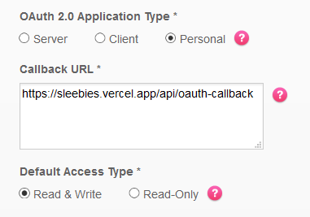

# Sleebies


A badge showing 'sleep' or 'awake' based on your FitBit data. An experiment with the FitBit API and Vercel.

Adapted from [datejer/vercel-badge](https://github.com/datejer/vercel-badge)

## Usage

```

```

Replace `[userid]` with the FitBit OAuth 2.0 user id retrieved from the OAuth endpoint (see below)

(optional) Add the `?style=` parameter to change the visual badge style.

| Parameter | Types                                                                           | Description                             | Example                                                                       |
| --------- | ------------------------------------------------------------------------------- | --------------------------------------- | ----------------------------------------------------------------------------- |
| style     | Default: `flat`<br>Available: `flat`, `flat-square`, `for-the-badge`, `plastic` | Select the visual style for your badge. | `https://sleebies.vercel.app/api/95QFMH?style=for-the-badge` |

## Deploying

You must deploy your own version to use this. I cannot make this work for other people without requesting a much stronger license from FitBit.

#### Getting FitBit tokens

* Sign up for an account at [https://dev.fitbit.com/login](https://dev.fitbit.com/login)
* Accept the Terms of Service for FitBit.
* Register a new application, making sure it has the following settings
  * OAuth 2.0 Application Type `Personal` (we need Heartbeat Intraday data which can only be requested with `Personal` on your own user id)
  * Callback URL `https://[your-vercel-deploy].vercel.app/api/oauth-callback` (where [your-vercel-deploy] is the name of your Vercel deployment
  * Default Access Type `Read & Write` (we need to write to make a fake sleep log to pull real time sleep data)

* You will then have FitBit `OAuth 2.0 Client ID` and `Client Secret`

#### Setting up Vercel

* Deploy this project to Vercel

[](https://vercel.com/new/git/external?repository-url=https%3A%2F%2Fgithub.com%2FCobertos%2Ffitbit-sleebies%2Ftree%2Fmaster)

* Set the `FITBIT_CLIENT_ID` environment variable to the `OAuth 2.0 Client ID` from the FitBit tokens
* Navigate to ![https://[your-vercel-deploy].vercel.app/api/oauth](https://[your-vercel-deploy].vercel.app/api/oauth) where [your-vercel-deploy] is the name of your Vercel deployment
* Authorize your application
* Grab the `FITBIT_USER_ID` and `FITBIT_USER_TOKEN` after the authorization
  * The token expires in 1 year
  * The token uses 3 scopes. `sleep` for sleep data, `heartrate` for intraday heartrate data, and `profile` for timezone information
* Set these in Vercel

Now you're ready to use. See **Usage** above to use :3

#### TODO

* You might want to change the `sleepingHeartRate` variable in `fitbit-sleebies/api/[userid].js` to your sleeping heart rate BPM. Sleeping people generally have a sleeping heartrate up to 24 BPM lower than their normal resting heartrate. I used \~8 BPM less as a threshold. In the future, this will either compare to average heartrate or it will be passed in.

## Contributing

Please refer to [CONTRIBUTING.md](CONTRIBUTING.md)